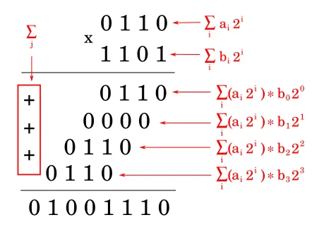
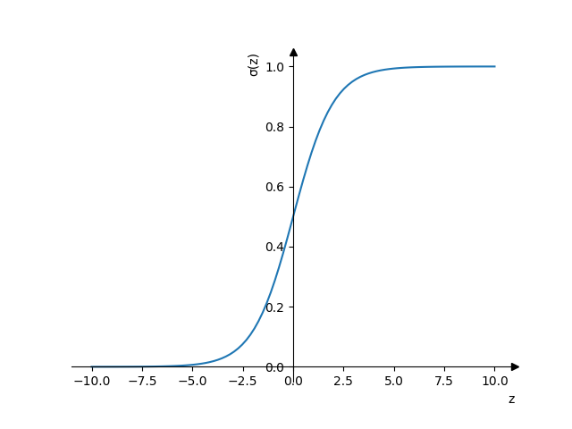

- [Умножение двух чисел](#org85bda40)
- [Умножение двоичных чисел](#orga9a893d)
- [Алгоритм Каратцубы](#org98b7547)
- [Алгоритм Каратцубы](#org1f8e7f3)
- [Алгоритм Каратцубы](#org031800d)
- [Классическое умножение](#org275ac17)
- [Классическое умножение](#org5c5a6f8)
- [Алгоритм Каратцубы](#org7635731)
- [Умножение матриц](#orgf428906)
- [Умножение матриц](#orgb6365f4)
- [Умножение матриц](#org92b39ca)
- [Умножение матриц](#org7b70cf4)
- [Алгоритм Штрассена](#orgd467f28)
- [Алгоритм Штрассена](#org5903125)
- [Алгоритм Штрассена](#org354a67b)
- [векторизация](#org6624fdf)
- [векторизация](#org9c20940)
- [векторизация](#org191c2c6)
- [векторизация](#orgbfe4ad5)
- [NumPy](#org5426251)
- [Логистическая регрессия](#orge8c0cac)
- [Обучение](#org26ae32d)
- [Котики!](#orgd5f90b0)
- [Tensorflow](#orgd57a70b)
- [Вопросы-ответы](#orgc198be0)


<a id="org85bda40"></a>

# Умножение двух чисел

\begin{equation}
\opmul{5678}{1234}\qquad
\end{equation}

*Можно ли лучше?*


<a id="orga9a893d"></a>

# Умножение двоичных чисел




<a id="org98b7547"></a>

# Алгоритм Каратцубы

```python
x = 5678
y = 1234

a = 56; b = 78
c = 12; d = 34
```


<a id="org1f8e7f3"></a>

# Алгоритм Каратцубы

```python

# step1
step1 = a * c
# step2
step2 = b * d
# step3
a_b = a + b
c_d = c + d
step3 = a_b * c_d
# step4:
# step3 - step2 - step1
step4 = step3 - step2 - step1
```


<a id="org031800d"></a>

# Алгоритм Каратцубы

```python

line1 = step1 * 10**4
line2 = step2
line3 = step4 * 10**2
result = (
    line1
    + line2
    + line3
)
print(result)
```

    7006652


<a id="org275ac17"></a>

# Классическое умножение

\begin{equation}
\opmul{5678}{1234}\qquad
\end{equation}


<a id="org5c5a6f8"></a>

# Классическое умножение

```python

print(classic(1234, 5678))
```

    7006652

```python


print(timeit.timeit(
    "classic(1234, 5678) == 7006652",
    globals=globals()
))
# print(timeit.timeit(
#     f"classic({big_x}, {big_y})",
#     globals=globals()
# ))
```


<a id="org7635731"></a>

# Алгоритм Каратцубы

```python


print(timeit.timeit(
    "karatsuba(1234, 5678) == 7006652",
    globals=globals()
))
# print(timeit.timeit(
#     f"karatsuba({big_x}, {big_y})",
#     globals=globals()
# ))
```


<a id="orgf428906"></a>

# Умножение матриц

\begin{equation}
\left[ \begin{array}{ccc} A & B \\ C & D \\ \end{array} \right]
\times
\left[ \begin{array}{ccc} E & F \\ G & H \\ \end{array} \right]
= \left[ \begin{array}{ccc} AE + BG & AF + BH \\ CE + DG & CF + DH \\ \end{array} \right]
\end{equation}


<a id="orgb6365f4"></a>

# Умножение матриц

```python
def mxm(A, X):
  n = len(A)    # A: n×m
  m = len(A[0])
  p = len(X[0]) # X: m×p
  B = [[0] * p] * n
  for i in range(n):
    for j in range(p):
      for k in range(m):
        B[i][j] += A[i][k]*X[k][j]
  return B
```

**Где ошибка в этом коде?**


<a id="org92b39ca"></a>

# Умножение матриц

```python
def mxm(A, X):
  n = len(A)    # A: n×m
  m = len(A[0])
  p = len(X[0]) # X: m×p
  B = [[0] * p for _ in range(n)]
  for i in range(n):
    for j in range(p):
      for k in range(m):
        B[i][j] += A[i][k]*X[k][j]
  return B
```


<a id="org7b70cf4"></a>

# Умножение матриц

<div class="org-center">
\(O(n^{3})\)
*Можно ли лучше?*
</div>


<a id="orgd467f28"></a>

# Алгоритм Штрассена

\begin{normalsize}
\left[ \begin{array}{cccc} 11 & 12 & 13 & 14 \\ 21 & 22 & 23 & 24 \\ 31 & 32 & 33 & 34 \\ 41 & 42 & 43 & 44 \\ \end{array} \right] =
\left[ \begin{array}{cc} A & B \\ C & D \\ \end{array} \right]
\end{normalsize}

\begin{normalsize}
\left[ \begin{array}{cccc} 11 & 21 & 31 & 41 \\ 12 & 22 & 32 & 42 \\ 13 & 23 & 33 & 43 \\ 14 & 24 & 34 & 44 \\ \end{array} \right] =
\left[ \begin{array}{cc} E & F \\ G & H \\ \end{array} \right]
\end{normalsize}


<a id="org5903125"></a>

# Алгоритм Штрассена

\begin{array}{l}
P_{1} = A(F - H), \\
P_{2} = (A + B)H, \\
P_{3} = (C + D)E, \\
P_{4} = D(G - E), \\
P_{5} = (A + D)(E + H), \\
P_{6} = (B - D)(G + H), \\
P_{7} = (A - C)(E + F) \\
\end{array}


<a id="org354a67b"></a>

# Алгоритм Штрассена

\begin{footnotesize}
\left[ \begin{array}{cc} AE+BG & AF+BH \\ CE+DG & CF+DH \end{array} \right] =
\left[ \begin{array}{ll} P_{5} + P_{4} - P_{2} + P_{6} & P_{1} + P_{2} \\ P_{3} + P_{4} & P_{1} + P_{5} - P_{3} + P_{7} \end{array} \right]
\end{footnotesize}


<a id="org6624fdf"></a>

# векторизация

-   Большинство операций процессора это SISD: Single Instruction Single Data
-   Процессор может поддерживать специальные регистры для <span class="underline"><span class="underline">[SIMD](https://ru.wikipedia.org/wiki/SIMD)</span></span>: Single Instruction Multiple Data


<a id="org9c20940"></a>

# векторизация

| 0     | 1        | 2        | 3        |
| a[0]= | not used | not used | not used |
| b[0]+ | not used | not used | not used |
| c[0]  | not used | not used | not used |


<a id="org191c2c6"></a>

# векторизация

| 0     | 1     | 2     | 3     |
| a[0]= | a[1]= | a[2]= | a[3]= |
| b[0]+ | b[1]+ | b[2]+ | b[3]+ |
| c[0]  | c[1]  | c[2]  | c[3]  |


<a id="orgbfe4ad5"></a>

# векторизация

-   Без векторизованных операций

```shell
g++ -o novec vecexample.cpp
echo "Без векторизации"
./novec 100000000
```

    Без векторизации
    Time used for norm computation=6.2414
      Norm-2  = 1.5000

```shell
g++ -O3 -mavx2 -o vec vecexample.cpp
echo "Используя векторизацию"
./vec 100000000
```

    Используя векторизацию
    Time used for norm computation=5.0961
      Norm-2  = 1.5000


<a id="org5426251"></a>

# NumPy

```python

_a = (
    np.arange(n, dtype=float) * 2
    * np.math.pi / n
)
a = s * (np.sin(_a) + np.cos(_a))
b = s * np.sin(2.0 * _a)
c = a + b
norm2 = np.sum(np.power(c, 2))

```

```shell
./numpy_vec.py 100000000
```

    Time used for norm computation = 7.12084
    Norm-2 = 1.50000


<a id="orge8c0cac"></a>

# Логистическая регрессия

\(z = w_{0}x + w_{1}x + \dots + w_{n}x + b\)
\(a = \frac{1}{1+e^{-z}}\)




<a id="org26ae32d"></a>

# Обучение

Чтобы минимизировать ошибку в ответах будем искать минимум функции, вычисляя градиент (производную) для каждой переменной.

\begin{normalsize}
w = w - \dfrac{\partial w}{\partial x_{n}}
\end{normalsize}


<a id="orgd5f90b0"></a>

# Котики!

<span class="underline"><span class="underline">[GitHub](https://github.com/pimiento/numerical_algorithms_ML_webinar/blob/master/nn_model.py)</span></span>


<a id="orgd57a70b"></a>

# Tensorflow

<span class="underline"><span class="underline">[Colab](https://colab.research.google.com/drive/1peolUQzHOVC4QVELMCBO1zluc1-pNsma?usp=sharing)</span></span>


<a id="orgc198be0"></a>

# Вопросы-ответы


